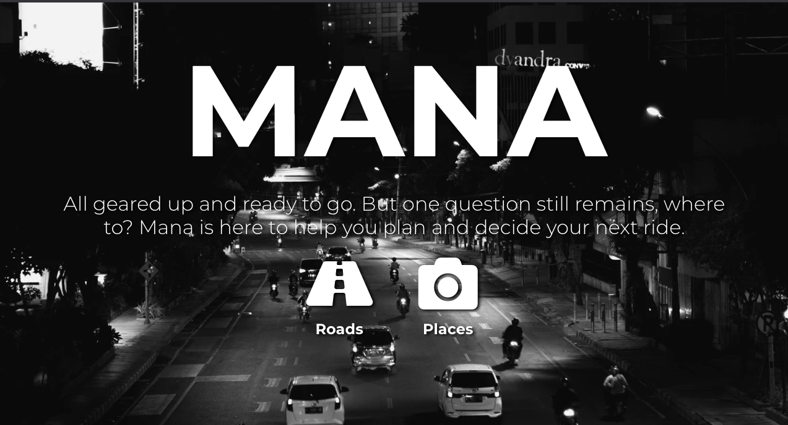
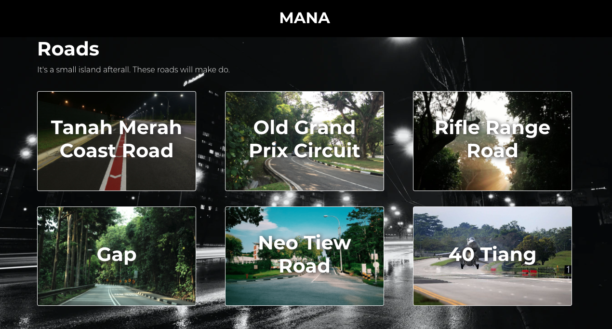
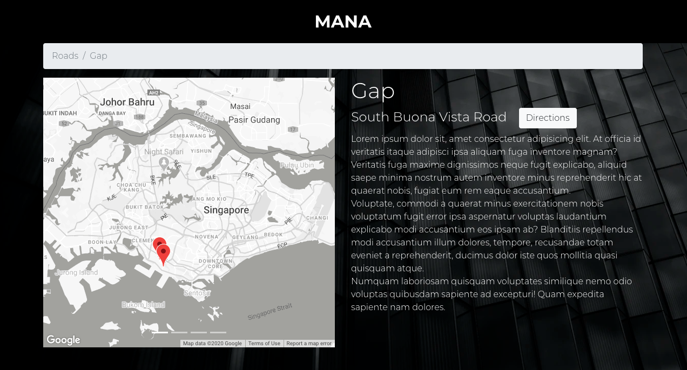
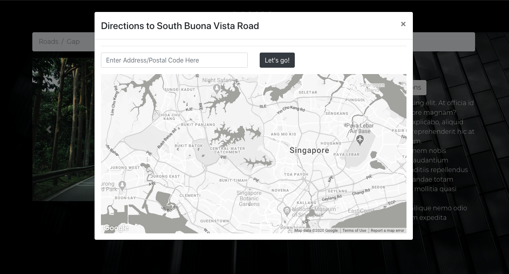
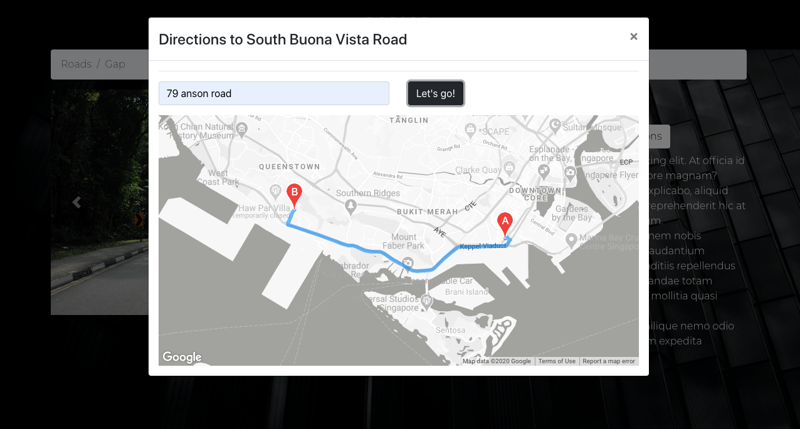

## Introduction
SEI 25 - Project 2
React App is hosted here: https://pages.git.generalassemb.ly/khairulsyazwan/Mana/

Start Page

Menu 

Info Page

Map Modal

#### React App Objectives
I have realised that most of the time when I'm out with my buddies to go for a ride, we barely have any places in min that we want to go to, and we'll spend alot of time thinking and riding to nowhere.

I created this app to simplify that thinking process by giving suggestions and perhaps places people have seen on social media but have no idea where they are.

#### Project Objectives
**Technical Requirements**
- **Build a web application using create-react-app**.  Must be your own work.
- **Use React framework** to build your application with *at least* 
  - 3 components
  - 4 props
  - 2 state properties
  - 2 setState
  - 2 routes
- **Use 3rd party API and/or Firestore**
  - API call with Axios and display the data for the user. You may use any API of your choosing or [Find an available API here](https://github.com/public-apis/public-apis)
  - You may also opt to use Firebase/Firestore if you need to store data.
- **Craft a `README.md` file that explains your app** to the world. [README Template](https://github.com/SEI2-jeddah/README-Template/blob/master/README.md)
- **Create wireframes** for your app and include it in your repo/readme.

## Breakdown

#### Technologies used:
1. React
2. CSS
3. Bootstrap
4. React-Bootstrap
5. React Router
6. React Google Maps API
7. Firebase

#### Further Possible Improvements
- Addition of user accounts
- Addition of adding places to favourites
- Ability to add more places from the user

#### Wireframes

